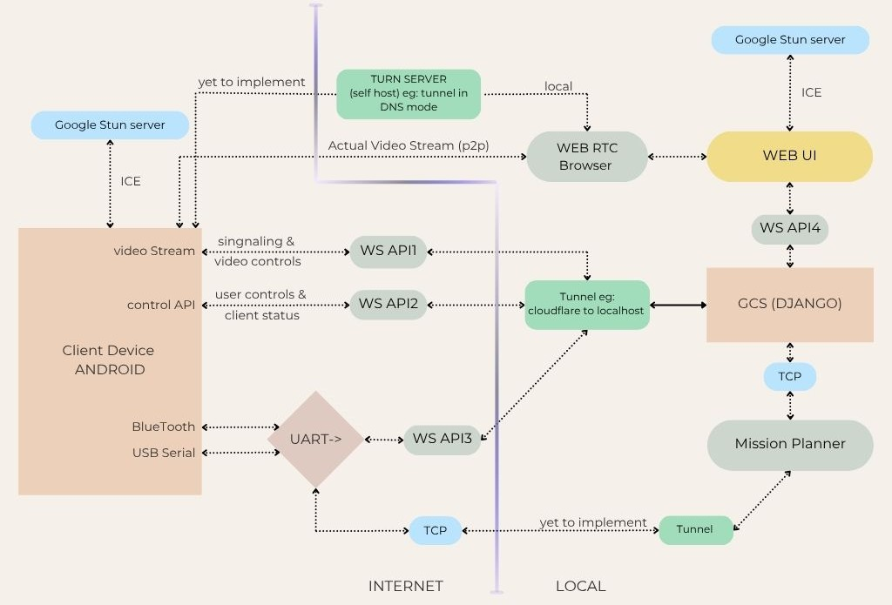

# USSOI CAMfeed 

> Note: API requests are not authenticated.
## 📑 Table of Contents

- [System Architecture](#-system-architecture)
- [Key Features](#-key-features)
- [API Endpoints](#-api-endpoints)
  - [Streaming API](#1-streaming-api-wsipstreaming)
  - [Control API](#2-control-api-wsipcontrolapi)
  - [Telemetry API](#3-telemetry-api-wsiptelemetry)
- [Getting Started](#-getting-started)
- [Notes](#-notes)
---

##  System Architecture

The following diagram illustrates the data flow and interaction between the Android application, the client, and the connected hardware (e.g., flight controller).



---

##  Key Features

* **Real-time Streaming:** Low-latency video and audio streaming using WebRTC.
* **Remote Control:** WebSocket API for starting/stopping services like streaming and Mavlink communication.
* **Device Telemetry:** Get real-time status updates from the Android device, including battery, network, and GPS data.
* **Bi-directional UART:** Raw telemetry endpoint for direct communication with connected hardware.
* **Background Operation:** The service is designed to run persistently in the background, even when the screen is off.

---

##  API Endpoints

The system exposes three primary WebSocket endpoints for different functionalities.

### 1. Streaming API: `ws://<ip>/streaming`

This endpoint handles the WebRTC negotiation for establishing the video and audio stream.

#### DATA  FORMAT 

1.  Upon a client's successful connection, the server sends a status update.

    ```json
    {
      "type": "getStatus",
      "status": "connection established"
    }
    ```

2.  The server then immediately sends its **ICE candidates** and **SDP offer** to initiate the WebRTC session.

    * **ICE Candidate Example:**
        ```json
        {
          "type": "ice-candidate",
          "candidate": {
            "candidate": "<candidate>",
            "sdpMid": "0",
            "sdpMLineIndex": 0
          }
        }
        ```
    * **SDP Offer Example:**
        ```json
        {
          "type": "offer",
          "sdp": "<sdp>"
        }
        ```

3.  The client must respond with its own **SDP answer** and **ICE candidates** to complete the handshake.

    * **SDP Answer:**
        ```json
        {
          "type": "answer",
          "sdp": "<your-sdp-answer>"
        }
        ```
    * **ICE Candidate:**
        ```json
        {
          "type": "ice-candidate",
          "candidate": "<your-candidate>",
          "sdpMid": "0",
          "sdpMLineIndex": 0
        }
        ```

#### Dynamic Configuration

You can configure the video stream on-the-fly by sending a `config` message.

```json
{
  "type": "config",
  "videoparams": {
    "width": 640,
    "height": 480,
    "fps": 15
  },
  "video": true,
  "audio": true,
  "bitrate": 1000
}
```
## 2. Control API : `ws://<ip>/control/api`

### 🎥 Streaming Controls
All actions are processed by `ServiceManager.java`.
1. This allows for starting and stopping the video stream.

    * **Stop Streaming**
        ```json
        {
        "sub_type": "stream",
        "control": "stop"
        }
        ```

    * **Start / Restart Streaming**
        ```json
        {
        "sub_type": "stream",
        "control": "restart"
        }
        ```

2.  This is used to manage the Mavlink communication link over UART (USB/BT).

    * **Stop Mavlink Communication**
        ```json
        {
        "sub_type": "mavlink",
        "control": "stop"
        }
        ```

    * **Start / Restart Mavlink Communication**
        ```json
        {
        "sub_type": "mavlink",
        "control": "restart"
        }
        ```
> **⚠️ Important Notes on Mavlink:**
>
> * If Mavlink was disabled before the service started, user permission is required when connecting a USB or Bluetooth device for the first time.
> * Physical reconnection of a USB device will always require the user to 
>  grant permission again.

---

###  Android Device Status

Request a  status report from the Android device.

* **Request Status**
    Send the following JSON to query the device:
    ```json
    {
      "sub_type": "client"
    }
    ```

* **Sample Response**
    You will receive a JSON object containing key device metrics:
    ```json
    {
      "nameValuePairs": {
        "bat%": 35,
        "batTemp": 36.5,
        "batAmp": 1.2,
        "signalDbm": -65,
        "sim": "jio",
        "netTyp": 13,
        "upMBps": 0.55,
        "dwnMBps": 2.34,
        "totalMb": 125.6,
        "latitude": 45.0760,
        "longitude": 24.8777,
        "altitude": 23.3,
        "accuracy": 5.0,
        "speed": 0.8
      }
    }
    ```


### 3. Telemetry API: `ws://<ip>/telemetry`
This endpoint provides a raw, bi-directional communication channel for UART/serial data. Any data sent or received through this WebSocket is forwarded directly to/from the connected hardware. Data is transmitted as a raw byte stream.